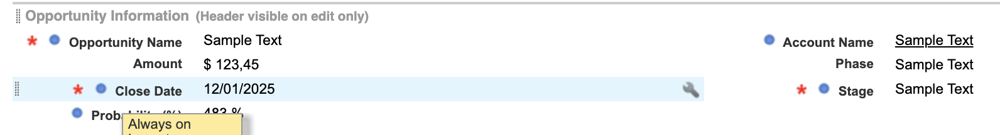
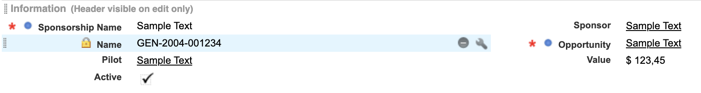

# Proyecto de Gestión de Patrocinios para la F1

## 1. Objetivo del reto

Evaluar el rendimiento técnico y el conocimiento de la plataforma **Salesforce** para desarrollar una solución que ayude a la **Fórmula 1** a gestionar los patrocinios de sus pilotos.

---

## 2. Solución

El objetivo de esta solución es crear una aplicación de Salesforce que permita a la Fórmula 1 gestionar los patrocinios de sus pilotos.

---

### 2.1. Modelo de datos

#### 2.1.1. **Contacto (Piloto)**

#### 2.1.2. **Cuenta (Patrocinador)**

#### 2.1.3. **Oportunidad**

#### 2.1.4. **Patrocinio**

---

### 2.2. Solución técnica

#### 2.2.1. Normas empresariales

1. Cada objeto creado se encuentra disponible en su Playground.
2. La aplicación tiene sus fichas necesarias para ingresar directamente al objeto.
3. La edad es un campo formula que con valor numerico que se contabiliza siempre que se entra al registro.
4. El Valor disponible es un campo formula que con valor numerico que se contabiliza siempre que se entra al registro.
5. Un piloto no puede ser marcado como "Activo" sin tener un equipo asignado.

6. Un piloto no puede estar vinculado a un patrocinio si está inactivo.

7. El mismo piloto no puede inscribirse dos veces con la misma dirección de correo electrónico.

8. No se puede crear una oportunidad con un valor superior al disponible en el registro del patrocinador

9. Un patrocinador no puede cambiar la cantidad total a menos de la cantidad en patrocinios actuales

10. Se debe crear un proceso de aprobación para la oportunidad:
    - Cambiar la fase a "En análisis" cuando se presente.
    - Si se aprueba, cambiar el estado a "Cerrado y ganado".
    - Si se rechaza, cambiar el estado a "Cerrado y perdido".

    

11. Una vez finalizada la aprobación, se enviará una notificación por correo electrónico al creador de la oportunidad.

    

#### 2.2.2. Reglas adicionales

1. Si una oportunidad está "Cerrada y perdida", no se puede cambiar.

    

2. No se puede crear un patrocinio hasta que la oportunidad esté "Cerrada y Ganada".

  
  
3. El valor del patrocinio no puede ser superior al valor cerrado en la oportunidad.

  

---

### 2.3. Retos del desarrollo

#### 2.3.1. Componente de pilotos activos

- Crear un componente **LWC** que enumere todos los pilotos activos y su mayor patrocinador.
- Mostrar los siguientes campos:
  - Nombre del piloto
  - Equipo del piloto
  - Nombre del patrocinador principal
- Hacer disponible este componente en la **Home** de la aplicación.

 

#### 2.3.2. Lote de inactivación del patrocinio

- Este reto se soluciono con el siguiente archivo.

| Carpeta      | Archivo  | Descripción                                              |
| :----------- | :------- | :------------------------------------------------------- |
| Classes         | InactivateSponsorshipsBatch.cls | La clase implementa la interfaz Database.Batchable, lo que permite procesar grandes volúmenes de datos en lotes. |

#### 2.3.3. Prueba de patrocinio

 

#### 2.3.4. Pantalla dividida de patrocinio

 

#### 2.3.5. Repetición de la validación piloto en el patrocinador

- Este reto se soluciono con el siguiente archivo.

| Carpeta      | Archivo  | Descripción                                              |
| :----------- | :------- | :------------------------------------------------------- |
| Triggers         | ValidateActiveSponsorship.cls | Este trigger asegura que no se puedan insertar o actualizar registros en Sponsorships__c si el patrocinador ya tiene un patrocinio activo, a menos que se ignore la validación.. |

---

## 3. Clases de prueba

Cada clase debe estar cubierta por pruebas unitarias que cubran al menos el **75% de código** y validen la funcionalidad de cada componente desarrollado.

 

---

## 4. Evaluación

- El diseño de las páginas y componentes será evaluado. Asegúrate de eliminar campos innecesarios y organizar adecuadamente los componentes en las páginas relámpago.
- Los informes y cuadros de mando deben ser creados para analizar los indicadores clave de rendimiento (KPI).

Se reviso detalladamente estos puntos.

---

## 5. Contacto

Si tienes alguna pregunta o inquietud sobre este proyecto, no dudes en contactarme:

- **Correo electrónico**: lorena.rippe94@gmail.com
- **GitHub**: [github.com/loregunner](https://github.com/loregunner)

---

*¡Gracias por revisar este proyecto!*
